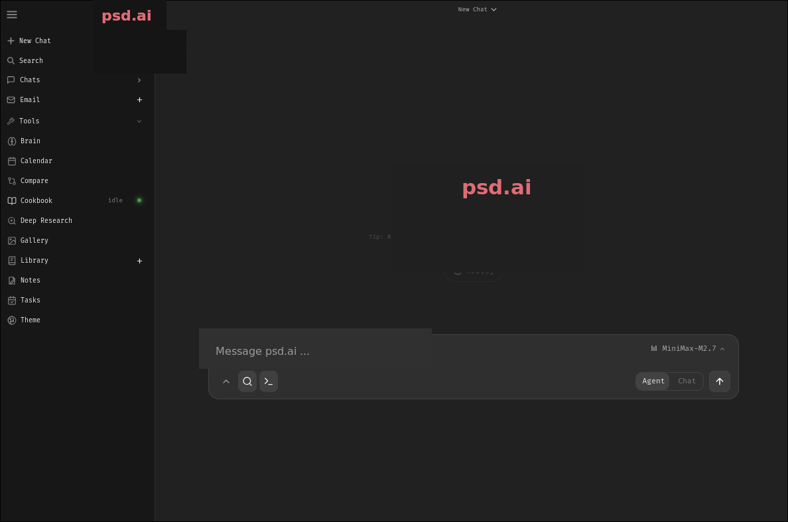

# psd-bot

The backend lives in the **`psd.ai/`** folder; the desktop application lives in
**`desktop/`** (Tauri 2 + React/Vite + Tailwind). This project targets
**Linux only — Fedora Workstation first** — and drives a real Fedora desktop:
Wayland or X11, PipeWire, systemd, and `dnf`.

psd.ai is a **desktop app**. There is no browser tab and no `localhost` URL to
open — the app window starts the Python engine privately inside itself and
talks to it over local IPC (see [`desktop/README.md`](desktop/README.md)).

## Talk to psd.ai (voice + PC control)

psd.ai ships a **Jarvis-style voice mode**. Open it with **Ctrl+Shift+T**, from
the microphone button in the left rail, or from the command palette.

* **Speak in any language — it always answers in English, out loud.** Hindi,
  Hinglish, anything: the reply is pinned to English and written for a
  text-to-speech engine (no markdown, no emoji, no bullet lists).
* **It actually does the work.** "open firefox", "turn the volume up",
  "press ctrl+s", "type hello", "what's my battery", "close chrome" — the
  request is understood, executed on your desktop, and reported back in one
  short sentence.
* **Hold Space** (push to talk) or switch on **Continuous** for a hands-free
  back-and-forth. Silence ends the turn.
* Voice → text happens locally with **faster-whisper** when it's installed; the
  browser's speech API is the fallback. Replies use the engine's TTS when you
  configure one, otherwise the browser speaks them.

The same PC control is available in typed chat: the agent gets
`computer_control` / `computer_screen` tools, so "open the calculator and type
1234" works without saying a word.

### What it can do on your PC

| Group | Actions |
| --- | --- |
| See | `screenshot`, `screen_size`, `windows`, `info` (CPU/RAM/disk/battery), `processes`, `clipboard_get` |
| Drive | `click`, `move`, `drag`, `scroll`, `type`, `key` (shortcuts like `ctrl+s`) |
| Apps | `open` (app, file or URL), `focus`, `close_window`, `kill` |
| System | `volume` (level / up / down / mute), `notify`, `clipboard_set`, `wait` |

App names are resolved on a Fedora desktop, so the familiar ones still work:
"notepad" opens the text editor, "explorer" opens Files, "task manager" opens
System Monitor, "store" opens GNOME Software.

### Wayland and X11

Everything is session-aware. On **Wayland** input goes through `ydotool`
(kernel uinput, works on every compositor) and `wtype`, screenshots through
`grim` on wlroots compositors (Sway, Hyprland) or through the **XDG Desktop
Portal** on GNOME and KDE, where the compositor deliberately makes you approve
each capture. Window listing works on Sway and Hyprland (their IPC trees);
GNOME and KDE keep their window tree private, so those two actions report
"not available here" instead of pretending. On **X11** the classic
`xdotool`/`wmctrl`/`scrot`/`xclip` stack does the same job. `./run.sh --doctor`
and **Settings → Voice & PC** tell you exactly which tools this session has,
with one copy-pasteable `dnf` line for whatever is missing.

### Safety rails

You asked for full access, so full access is the default — with a short list of
things psd.ai will refuse **no matter what you say**:

* no `mkfs`/`wipefs`/`parted`/`dd`/`shred`, no `rm -rf` of a system directory,
  no recursive `chmod`/`chown` of `/`
* no `shutdown`/`reboot`/`systemctl poweroff`, no boot or firmware changes
  (`grub2-*`, `efibootmgr`, `mokutil`, `fwupdmgr`)
* no removing the kernel or the bootloader with `dnf`/`rpm`, no downgrading
  SELinux (`setenforce 0`)
* it can never end its own process, the desktop shell, the display manager,
  systemd, D-Bus, PipeWire or NetworkManager

Everything else runs. If you want a prompt before anything risky (ending a
process), switch **Autonomy → Ask first** in **Settings → Voice & PC**. Turn
**PC control** off there to refuse every mouse, keyboard and window action while
keeping chat and voice intact.

## Run it on Fedora

```bash
./run.sh
```

That's it. It will:

1. install the system packages this project builds and runs against, with
   **`dnf`** (first run only, skipped when already present) — including the
   Rust toolchain
2. find Python 3.11+
3. **build and open the graphical installer** — a native window, like a real
   installer: progress bar, the running step, live output, and faults listed
   properly with Retry / Skip buttons
4. inside that window: create the virtual environment, install dependencies
   and the **Jarvis extras** (offline speech-to-text + PC control), run
   first-time setup, and build the psd.ai desktop app (first run only)
5. **download and run a hardware-fit group of 3 to 6 local models** with its
   own progress bar in the same window
6. hit **Launch** and the **psd.ai desktop app** opens — on the very first
   launch it asks you to create your admin account right in the window

An already installed psd.ai skips the installer entirely and opens the app
straight away.

### Graphical installer

The installer window ([`installer/`](installer/README.md)) is a small Tauri
app — not a browser page. It shows a real progress bar for the whole setup,
a per-step timeline, the model-group download with percentage/GB numbers and
a card per model as it comes up, and when something faults it stops and lists
the fault properly: which step, the exit code, what failed, a fix hint, the
suspicious output lines, and **Retry step** / **Skip step** buttons.
Everything it runs is logged to `logs/installer.log` (models additionally to
`logs/local-model.log`). Closing the installer window stops everything it
started — no orphan downloads or servers.

**No display (SSH), no Rust toolchain, or `--no-gui`?** The exact same steps
run in the terminal instead, and `./run.sh` opens a **browser dashboard**
(`http://127.0.0.1:7123`, loopback only) as the fallback progress view: step
timeline, model download bar, model cards and an error panel. Without a
browser session the same content is in `logs/run.log` and
`logs/local-model.log`.

### run.sh options

| Command | What it does |
| --- | --- |
| `./run.sh --help` | list the options |
| `./run.sh --doctor` | check this machine: Python, venv, microphone, disk space, session (Wayland/X11), PC-control tools, PC-control status |
| `./run.sh --repair` | rebuild the venv and reinstall everything from scratch |
| `./run.sh --update` | `git pull` then refresh dependencies |
| `./run.sh --rebuild` | throw away the built app and rebuild it |
| `./run.sh --no-voice` | skip the Jarvis extras |
| `./run.sh --no-models` | skip the local model group for this run |
| `./run.sh --no-app` | set everything up, then stop without opening the window |
| `./run.sh --no-gui` | install without the graphical installer window and browser dashboard (terminal only) |
| `./run.sh --no-system-deps` | never touch `dnf`; use whatever is installed |
| `./run.sh --skip-numpy-check` | start even if the numpy import probe fails |

`run.sh` also keeps a timestamped log in **`logs/run.log`**, warns you when
there isn't enough disk space for the model group, and retries a failed `pip`
install once before giving up.

`run.sh` uses a prebuilt app if one is present
(`desktop/src-tauri/target/release/psd-ai`). Otherwise it installs the build
toolchain with `dnf` — Node.js, Rust/cargo and the WebKitGTK/GTK development
packages — and builds the app once. After that, re-running `run.sh` just opens
the app. Close the window to stop everything, including the model group.

Want it at login instead? `./psd.ai/install-service.sh` installs a **systemd
user unit** (`psd-ai-ui.service`) so the engine starts with your session, with
no root involved.

## The Swarm — saare models, ek team

**Swarm** (Ctrl+K → "Swarm", ya left rail ka network icon) is the whole local
model group working **together** on one request, in one view:

* **The strongest resident model becomes the manager.** It splits your request
  into short specialist steps and writes the final answer from the reports.
* **Every other model is a worker — and works only on what it is good at.**
  The coding-tuned model writes code, the "thinking" model does analysis, the
  smallest quick model does fast lookups, a vision model handles images. Work
  is routed by specialty match first, then by power (total params) × speed
  (measured tok/s on your machine), so each step is both quick and strong.
* **Independent steps run in parallel** — up to six models crunching at once —
  with each specialist's text streaming live into its lane, and the manager
  writes one clean, combined answer.
* **A critic checks every answer before you see it.** The manager drafts, the
  sharpest "thinking" worker that isn't the manager attacks the draft —
  factual errors fixed, invented details removed, missing pieces added — and
  only the polished answer ships. (Verify answers on/off in Swarm settings.)
* **Auto-failover.** If a specialist crashes or returns nothing mid-step, the
  next-best model for that job takes over automatically — a dead endpoint
  never costs you an answer.
* **Full internet access for research steps.** The scout searches the live
  web through psd.ai's own search service, and the manager cites the real
  sources it used. (Toggle: Internet on/off in the Swarm header.)
* **The swarm remembers.** Durable facts from every swarm turn — or from any
  URL you hand it ("Learn from a page") — are stored locally and injected
  into future swarm prompts. One click to forget.
* **Cloud assist (opt-in).** Remote endpoints you configured in
  Settings → Models (OpenAI, Anthropic, OpenRouter…) can join as specialist
  workers for steps the local team can't nail. Local models always manage and
  the default is fully offline — flip **Cloud assist** on in Swarm settings
  when you want the heavy artillery. API keys stay in the engine; the UI
  never sees them.
* **You control the team.** Switch any worker off/on from the roster cards,
  flip parallel / verify / auto-learn / cloud-assist / plan-steps in Swarm
  settings. Everything is admin-gated like the rest of the app.

The engine lives in `psd.ai/src/swarm.py` (no extra service — it talks to the
same llama-server endpoints the app already runs) with routes under
`/api/swarm/*`.

## The local AI model group

Step 6 opens a **second window** titled *psd.ai - local model group*. On the
first run it downloads three to six hardware-fit GGUF models concurrently and
runs one `llama-server` per model on ports starting at `8080`. Everything is
cached **on the device, outside the project folder** —
`~/.local/share/psd.ai/runtime` (the XDG data dir; override with
`PSD_AI_RUNTIME_DIR`). So you can delete or re-download the code as often as
you like and later launches still start in a few seconds. An old
`psd.ai/runtime/` folder is moved there automatically.

It measures your RAM, GPU and CPU, then selects the strongest group that can
stay resident together. The group never has fewer than three models and never
exceeds six. On a typical machine it looks like this:

| Your machine | Example resident group (primary first) |
| --- | --- |
| 8 GB RAM | SmolLM3 3B Q4_K_M, Qwen3 1.7B, Qwen3 0.6B |
| 16 GB RAM | Qwen3.5 9B Q4_K_M, SmolLM3 3B, Qwen3 0.6B |
| 24 GB RAM | gpt-oss 20B MXFP4, Qwen3 1.7B, Qwen3 0.6B |
| 32 GB RAM | Devstral Small 2 24B Q4_K_M, Qwen3.5 4B Q5_K_M, Qwen3 1.7B |
| 32 GB + 12 GB GPU | Gemma 4 26B A4B Q4_K_M, Qwen3 1.7B, Qwen3 0.6B |
| 64 GB + 24 GB GPU | Qwen3.6 35B A3B Q4_K_M, Devstral Small 2 24B, SmolLM3 3B, Qwen3 0.6B |
| 96 GB RAM | Qwen3.5 122B A10B Q2_K, gpt-oss 20B, Qwen3 1.7B |

(These are real planner outputs for the bundled catalogue; your machine's exact
group comes out of `python psd.ai/scripts/local_llama.py --print`.)

Selection is based on the **combined** weights, KV cache, GPU/CPU memory, and
server headroom — not just whether each model fits individually:

- **Context window first, quality second.** A smaller quant with a usable
  context beats a sharper model that would starve the other group members.
- **MoE models are the default on mid-range machines.** A 35B model with 3B
  active parameters has the knowledge of a 35B model and the token cost of a
  3B one, so experts are pinned to RAM (`--n-cpu-moe`) while the KV cache and
  attention stay where they are fast.
- Weight downloads run in parallel, while each server gets its own local port
  and endpoint in **Settings → Models**.
- F16/BF16 is avoided in favour of faster Q8/Q6/Q5/Q4 quantisations, and the
  first model in the group becomes the default chat model.

`PSD_MODEL_PROFILE=power` trades group size for a stronger primary with a
longer context; `max` spends the whole machine on a single model instead of a
group. `PSD_MODEL_TIER=coding` (or `reasoning`) makes the primary a specialist.

The server itself is launched with `--flash-attn on` and a `q8_0` KV cache,
which roughly halves the memory the conversation history costs — that is what
buys a long window on a 16 GB laptop.

### Hybrid Intel CPUs (12th gen and later)

Chips like the i7-13620H mix fast **P-cores** with slow **E-cores**. Token
generation is memory-bound and does *not* scale past the P-cores, while the
E-cores drag every worker down to their speed — measured losses of 20–30%. So
`run.sh` counts the P-cores and uses exactly that many threads (6 on a 13620H),
rather than the 16 that `nproc` reports.

### Integrated graphics

An Intel UHD or Iris Xe adapter reports itself as a GPU with ~128 MB of
dedicated VRAM. Nothing useful offloads to that, so `run.sh` treats the machine
as CPU-only and downloads the smaller CPU build instead of the Vulkan one. A
real AMD or NVIDIA GPU picks the Vulkan/CUDA/ROCm build of llama.cpp
automatically.

Every model is registered as a separate **psd.ai Local Llama** endpoint. The
strongest selected model becomes the default chat model — but only if you have
not already chosen one, so an existing setup is never overwritten.

**Keep that second window open** while you use psd.ai; closing it stops the whole group.

### Options

| Do this | To |
| --- | --- |
| set `PSD_NO_LOCAL_MODEL=1` | skip the local model group entirely and bring your own |
| set `LLAMA_PORT=9090` | use 9090 as the first model port (the group uses the next ports too) |
| set `PSD_AI_RUNTIME_DIR=/mnt/big/ai-models` | keep llama.cpp + model weights somewhere else (e.g. a bigger drive) |
| run `python psd.ai/scripts/local_llama.py --print` | show the hardware-fit group, no downloads |
| run `python psd.ai/scripts/local_llama.py --list-models` | list the whole catalogue |
| run `python psd.ai/scripts/local_llama.py --model qwen3.5-9b` | prefer a model while filling the group |
| run `python psd.ai/scripts/local_llama.py --single-model` | use the legacy one-model mode |
| set `PSD_NO_LOCAL_STT=1` | skip the local Whisper download (voice input uses the browser) |
| set `PSD_AI_COMPUTER_CONTROL=0` | refuse every mouse / keyboard / window action |

If the download or the GPU start fails, psd.ai still opens — the failure is
reported in that window and you can add a model under **Settings → Models**
inside the app.

### Troubleshooting

**"numpy cannot be imported" / "import hangs"** — the probe times
`import numpy` with a budget (`NUMPY_IMPORT_BUDGET`, default 60 s) and retries
once, because the first load compiles caches under `~/.cache`. If it still
fails:

1. `./run.sh --doctor` — it times `import numpy` and prints the result.
2. Run the command it prints by hand. If the first run is slow and later ones
   are instant, that is the cache warming up, not a failure.
3. `./run.sh --skip-numpy-check` starts psd.ai anyway (RAG and semantic search
   will be degraded if numpy is genuinely broken).

**PC control says a tool is missing** — the status panel prints the exact line,
for example
`sudo dnf install ydotool wtype grim slurp wl-clipboard wpctl libnotify`.
After installing ydotool, start its daemon once:
`sudo systemctl enable --now ydotoold` (it owns `/dev/uinput`).

**Screenshots ask for permission every time on GNOME/KDE** — that is the XDG
Desktop Portal doing its job: those compositors do not implement
`wlr-screencopy`, so the portal is the only capture path there. On Sway or
Hyprland `grim` captures without asking.

**`windows`/`focus` return "not available"** — GNOME and KDE keep their window
tree private on Wayland (and GNOME has disabled the Shell D-Bus `Eval` that
used to expose it). Sway and Hyprland support it; an X11 session always does.

**SELinux** — psd.ai runs fine in Enforcing mode as a normal user process. The
only thing that changes under SELinux is what a misbehaving process *can*
reach, which is exactly what you want from an agent with desktop control.
`run.sh --doctor` reports the current mode.

`--doctor` also reports the microphone, free disk space, whether the Jarvis
extras and faster-whisper are installed, and the live PC-control status.

## Desktop app (Linux)

```bash
cd desktop
npm install
npm run tauri dev      # run
npm run tauri build    # bundle/rpm/*.rpm + bundle/appimage/*.AppImage
```

Requires Node.js 18+ and Rust, plus the WebKitGTK 4.1 and GTK3 development
packages (`sudo dnf install webkit2gtk4.1-devel gtk3-devel libsoup3-devel
javascriptcoregtk4.1-devel`). For a packaged build instead of a local one, see
[`packaging/psd-ai.spec`](packaging/psd-ai.spec) (RPM),
[`packaging/psd-ai.desktop`](packaging/psd-ai.desktop) and
[`packaging/psd-ai.metainfo.xml`](packaging/psd-ai.metainfo.xml). Details in
[`desktop/README.md`](desktop/README.md).

## Branding

The app is presented as **psd.ai** everywhere: the window title, the setup and
login screens, the sidebar and the welcome screen. The shared imagery lives in
`psd.ai/assets/branding/` — `psd_ai-wordmark.png` (the logo),
`psd_ai-browser.jpg` (light theme) and `psd_ai.jpg` (dark theme):

<p align="center">
  
</p>

Headless / server / Docker instructions for the backend alone are in
[`psd.ai/README.md`](psd.ai/README.md) and
[`psd.ai/website/setup.md`](psd.ai/website/setup.md).
